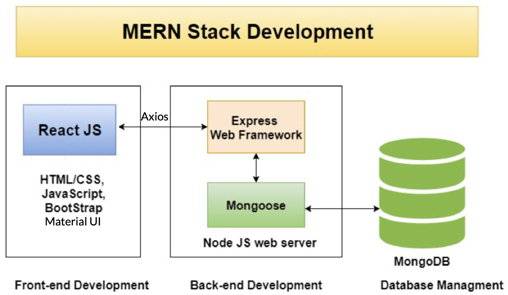

# Bruin Trade
A web application where UCLA students in need of more meal plan balance for meals, beverages, and snacks can trade with students with extra balance.

## Technology Stack


## Run
```
git clone https://github.com/SparkShen02/Bruin-Trade.git
```

```
cd Bruin-Trade/server
npm install
npm start
```

```
cd Bruin-Trade/client
npm install
npm start
```

## Contributors
- [Hongzhe Du](https://github.com/HZD01)<br />
- [Mubai Hua](https://github.com/MubaiHua)<br />
- [Tang Mohan](https://github.com/TangMohan)<br />
- [Yu Shen](https://github.com/SparkShen02)<br />
- [Yuxuan Qi](https://github.com/Yuxuan02)<br />
